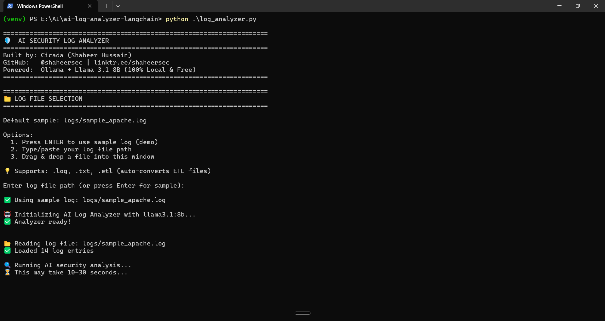

# 🛡️ AI Security Log Analyzer

AI-powered web server log analysis using **LangChain** and **Ollama** (Llama 3.1 8B) - 100% local, 100% free.


## 🎯 What It Does

Analyzes Apache/Nginx/IIS server logs using AI to detect:

- 🔴 SQL injection attacks
- 🟠 Cross-site scripting (XSS)
- 🟡 Brute force login attempts
- 🔵 Path traversal attacks
- 🟢 Reconnaissance scans
- ⚪ API abuse patterns

**Output:** Clean security reports with threat levels, plain English explanations, and actionable recommendations.

## 📸 Demo



## 🚀 Why This Matters

Most AI security tools require expensive cloud APIs ($50-200/month). This runs **100% offline** with zero API costs - perfect for small businesses, developers, and security professionals.

### Key Benefits:

- ✅ **Zero cost** - No API fees, completely free
- ✅ **Complete privacy** - Logs never leave your machine
- ✅ **Offline capable** - Works without internet (after model download)
- ✅ **Auto ETL conversion** - Handles Windows Event Trace Logs
- ✅ **Professional reports** - Formatted output saved to file
- ✅ **User-friendly** - Plain English explanations

## 🛠️ Tech Stack

- **Python 3.8+** - Core language
- **LangChain** - AI orchestration framework
- **Ollama** - Local LLM runtime
- **Llama 3.1 8B** - Meta's open-source language model (4.7B parameters)

## ⚙️ Installation

### Prerequisites

- Python 3.8 or higher
- 8GB RAM minimum (16GB recommended)
- 5GB free disk space

### Step 1: Install Ollama

**Windows:**

1. Download: https://ollama.com/download
2. Run installer
3. Verify: `ollama --version`

**Mac/Linux:**

```bash
curl -fsSL https://ollama.com/install.sh | sh
```

### Step 2: Download Llama 3.1 8B

```bash
ollama pull llama3.1:8b
```

This downloads ~4.7GB (takes 5-15 minutes depending on internet speed).

### Step 3: Clone Repository

```bash
git clone https://github.com/Shaheer-Cybersec/ai-log-analyzer-langchain.git
cd ai-log-analyzer-langchain
```

### Step 4: Set Up Python Environment

```bash
# Create virtual environment
python -m venv venv

# Activate it
# Windows:
venv\Scripts\activate
# Mac/Linux:
source venv/bin/activate

# Install dependencies
pip install -r requirements.txt
```

## 🎮 Usage

### Interactive Mode (Recommended)

```bash
python log_analyzer.py
```

**Options:**

1. Press **Enter** - Use sample log (demo with attack patterns)
2. **Type/paste** - Your log file path
3. **Drag & drop** - File into terminal window

**Supported formats:** `.log`, `.txt`, `.etl` (auto-converts Windows ETL files)

### Command-Line Mode

```bash
# Analyze specific log file
python log_analyzer.py /var/log/apache2/access.log

# Windows example
python log_analyzer.py C:\inetpub\logs\LogFiles\access.log

# Windows ETL (auto-converts)
python log_analyzer.py C:\Windows\Logs\WindowsUpdate\file.etl
```

### Python Script Mode

```python
from log_analyzer import SecurityLogAnalyzer

analyzer = SecurityLogAnalyzer()
analyzer.analyze_file("path/to/your/logs.log")
```

## 📊 Sample Output

======================================================================
🟠 THREAT LEVEL: High 🟠
EXECUTIVE SUMMARY:
Multiple security threats detected including brute force attacks,
SQL injection, and cross-site scripting attempts.
━━━━━━━━━━━━━━━━━━━━━━━━━━━━━━━━━━━━━━━━━━━━━━━━━━━━━━━━━━━━━━━━━━
SECURITY ISSUES DETECTED:

Brute Force Login Attack
IP Address: 185.220.101.45
What happened: 5 failed login attempts in 4 seconds, then succeeded
Risk: Compromised account - attacker may have gained access
SQL Injection Attempt
IP Address: 192.168.1.103
What happened: Attacker tried to inject database commands
Risk: Could expose or modify sensitive database information
Cross-Site Scripting (XSS)
IP Address: 192.168.1.102
What happened: Malicious JavaScript injected in search parameter
Risk: Could steal user session cookies or redirect visitors

━━━━━━━━━━━━━━━━━━━━━━━━━━━━━━━━━━━━━━━━━━━━━━━━━━━━━━━━━━━━━━━━━━
IMMEDIATE ACTIONS REQUIRED:

Block IP addresses: 185.220.101.45, 192.168.1.103, 192.168.1.102
Investigate account accessed by IP 185.220.101.45
Review application input validation and implement parameterized queries
Enable rate limiting on login endpoints (max 3 attempts/minute)

━━━━━━━━━━━━━━━━━━━━━━━━━━━━━━━━━━━━━━━━━━━━━━━━━━━━━━━━━━━━━━━━━━
📄 Detailed report saved to: reports/security_report_20260506_153045.txt

## 🎯 What This Tool Is For

### ✅ Use This Tool When:

- You run a web server (Apache, Nginx, IIS)
- You want to detect attacks on your website
- You have server access logs to analyze
- You need to identify security threats
- You want AI-powered pattern detection

### ❌ Do NOT Use This Tool For:

- Scanning your personal computer for viruses
- Detecting malware on Windows/Mac
- Replacing antivirus software
- Monitoring local PC activity

### 🎯 Target Users:

- Web developers running servers
- Small business website owners
- Freelance system administrators
- Security-conscious startups
- Anyone managing web applications

## 💡 Real-World Example

**Scenario:** You run a small e-commerce website on a VPS server. You notice slow performance and want to check if you're under attack.

**Steps:**

1. SSH into your server
2. Download your Apache access.log
3. Run: `python log_analyzer.py /var/log/apache2/access.log`
4. Review AI analysis showing 3 attack patterns
5. Block malicious IPs in firewall
6. Patch identified vulnerabilities

**Result:** Prevented a data breach by identifying and stopping attacks early.

## 📁 Project Structure

ai-log-analyzer-langchain/
├── log*analyzer.py # Main application
├── logs/ # Sample log files
│ └── sample_apache.log
├── reports/ # Generated analysis reports
│ └── security_report*[timestamp].txt
├── screenshots/ # Demo screenshots
├── requirements.txt # Python dependencies
└── README.md # This file

## 🔮 Future Enhancements

- [ ] Support for more log formats (Syslog, Windows Event, firewall logs)
- [ ] Real-time log monitoring with alerts
- [ ] Web UI dashboard
- [ ] Automatic IP blocking integration
- [ ] Multi-model support (Claude API, GPT-4 option for cloud analysis)
- [ ] Historical trend analysis
- [ ] Custom alert rules

## 🤝 Contributing

Found a bug or have a feature idea? Open an issue or submit a PR!

## 📜 License

MIT License - feel free to use this in your own projects.

## 👤 Author

**Cicada (Shaheer Hussain)** - AI Security Engineer  
🔗 [All Links](https://linktr.ee/shaheersec)

Building AI-powered cybersecurity tools in public.

---

**Part of my 90-day AI x Cybersecurity journey** → [View all projects](https://github.com/Shaheer-Cybersec/ai-cybersecurity-journey)

---

## 🙏 Acknowledgments

- Built with [LangChain](https://github.com/langchain-ai/langchain)
- Powered by [Ollama](https://ollama.com/)
- Uses [Llama 3.1 8B](https://ai.meta.com/llama/) by Meta
